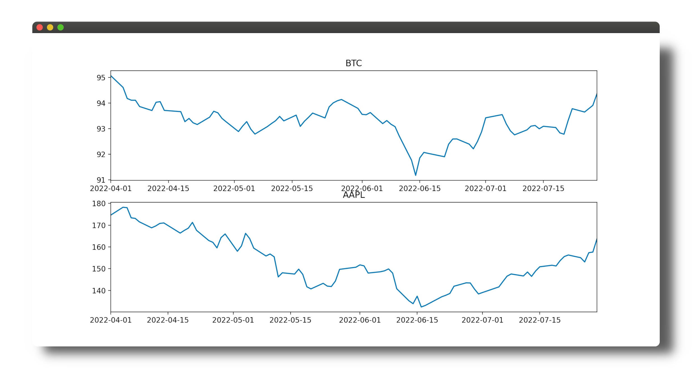

# cryptobot

Repository for tinkering with crypto trading strategies and visualising bot performance.

## APIs
* twleve_edata (data-retrieval)
* yahoofin (data-retrieval)
* [yfinance](https://algotrading101.com/learn/yfinance-guide/) (data-retrieval)
* alpaca (placing order)